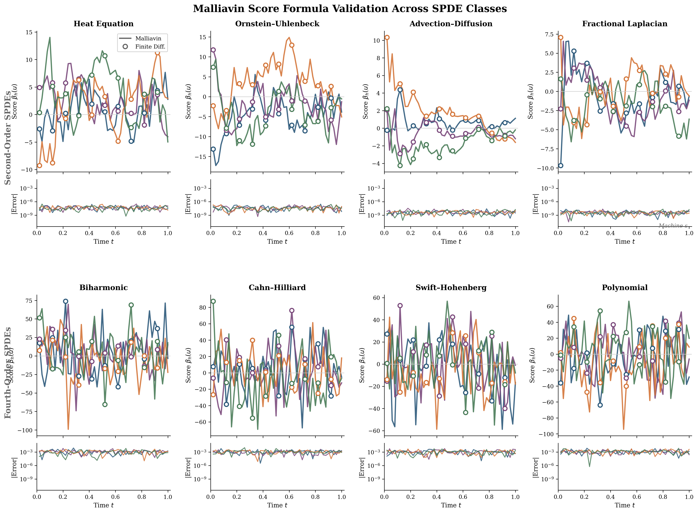

# Score Formula Validation for Infinite-Dimensional SPDEs

[](https://www.python.org/downloads/)
[](https://opensource.org/licenses/MIT)

Numerical validation of the Malliavin score formula for linear stochastic partial differential equations (SPDEs) using spectral Galerkin discretisation in the sine eigenbasis.

This code accompanies the paper:

> **Score-Based Diffusion Models in Infinite Dimensions: A Malliavin Calculus Perspective**

## Overview

This repository provides a rigorous numerical validation of the closed-form logarithmic derivative (score function) for infinite-dimensional diffusion processes governed by linear SPDEs of the form

$$\mathrm{d}u(t) = Au(t)\,\mathrm{d}t + Q^{1/2}\mathrm{d}W_t, \quad u(0) = u_0 \in H,$$

where $H$ is a separable Hilbert space, $A$ generates a strongly continuous semigroup $S(t) = e^{tA}$, and $Q^{1/2}: U \to H$ is a Hilbert–Schmidt operator introducing spatially correlated (coloured) noise.

The **Malliavin score formula** derived in the paper states that for directions $h \in \mathcal{H}_t := \operatorname{Ran}(\gamma_t^{1/2})$ (the Cameron–Martin space), the logarithmic derivative of the transition measure is

$$\beta_h(u) = -\langle u - S(t)u_0, \gamma_t^{-1} h \rangle_H,$$

where $\gamma_t = \int_0^t S(s) Q^{1/2}(Q^{1/2})^* S(s)^* \,\mathrm{d}s$ is the Malliavin covariance operator.

## Mathematical Framework

### Spectral Galerkin Discretisation

We consider the state space $H = L^2(0,1)$ with homogeneous Dirichlet boundary conditions. The Laplacian $\Delta$ admits the orthonormal eigenbasis

$$\varphi_k(x) = \sqrt{2} \sin(k\pi x), \quad -\Delta \varphi_k = \lambda_k \varphi_k, \quad \lambda_k = (k\pi)^2.$$

For operators of the form $A = f(-\Delta)$, the SPDE decouples in eigenspace into independent scalar processes:

$$\mathrm{d}u_k(t) = a_k u_k(t)\,\mathrm{d}t + \sqrt{q_k}\,\mathrm{d}B_k(t), \quad k = 1, \ldots, N,$$

where $a_k = f(\lambda_k)$ are the operator eigenvalues and $q_k = k^{-\alpha}$ (with $\alpha = 2$) ensures trace-class regularity.

### Malliavin Covariance in Eigenspace

The solution $u_k(t)$ is Gaussian with mean $m_k(t) = e^{a_k t} u_{0,k}$ and the Malliavin covariance eigenvalues

$$\gamma_k(t) = q_k \cdot \frac{e^{2a_k t} - 1}{2a_k},$$

with the convention $\gamma_k(t) = q_k t$ when $a_k = 0$.

### Score Formula in Eigenspace

The Malliavin score formula reduces to

$$\beta_h(u) = -\sum_{k=1}^N \frac{(u_k - m_k) h_k}{\gamma_k},$$

which we validate against the central finite-difference approximation

$$\beta_h^{\mathrm{FD}}(u) = \frac{\log p_t(u + \varepsilon h) - \log p_t(u - \varepsilon h)}{2\varepsilon}.$$

## Implemented SPDE Classes

The code implements eight classes of linear SPDEs, all of which are supported by the Malliavin framework:

### Second-Order Operators

| Class | Operator $A$ | Eigenvalues $a_k$ | Physical Interpretation |
|-------|--------------|-------------------|------------------------|
| `HeatEquation` | $\Delta$ | $-(k\pi)^2$ | Standard diffusion |
| `OrnsteinUhlenbeck` | $\Delta - \alpha I$ | $-(k\pi)^2 - \alpha$ | Damped diffusion |
| `AdvectionDiffusion` | $\nu\Delta$ | $-\nu(k\pi)^2$ | Transport with diffusion |
| `FractionalLaplacian` | $-(-\Delta)^\alpha$ | $-(k\pi)^{2\alpha}$ | Anomalous diffusion |

### Fourth-Order Operators

| Class | Operator $A$ | Eigenvalues $a_k$ | Physical Interpretation |
|-------|--------------|-------------------|------------------------|
| `Biharmonic` | $-\Delta^2$ | $-(k\pi)^4$ | Thin plate mechanics |
| `CahnHilliard` | $-\Delta^2 + \beta\Delta$ | $-(k\pi)^4 + \beta(k\pi)^2$ | Phase separation |
| `SwiftHohenberg` | $r - (1 + \Delta)^2$ | $r - (1 - (k\pi)^2)^2$ | Pattern formation |

### General Polynomial

| Class | Operator $A$ | Eigenvalues $a_k$ |
|-------|--------------|-------------------|
| `PolynomialLaplacian` | $\sum_j c_j \Delta^j$ | $\sum_j c_j (-1)^j (k\pi)^{2j}$ |

## Code Architecture

```
score_validation.py
├── Configuration
│   ├── SimulationConfig (dataclass)      # Immutable simulation parameters
│   └── Plot styling (matplotlib rcParams)
│
├── Abstract Base Class
│   └── LinearSPDE (ABC)
│       ├── _compute_operator_eigenvalues()  # Abstract: define a_k
│       ├── _validate_stability()            # Ensure a_k < 0
│       ├── _compute_semigroup_and_covariance()  # Compute S(t), γ_t
│       ├── score_malliavin()                # Exact formula
│       └── score_finite_difference()        # FD approximation
│
├── SPDE Implementations
│   ├── HeatEquation
│   ├── OrnsteinUhlenbeck
│   ├── AdvectionDiffusion
│   ├── FractionalLaplacian
│   ├── Biharmonic
│   ├── CahnHilliard
│   ├── SwiftHohenberg
│   └── PolynomialLaplacian
│
├── Simulation
│   └── simulate_score_trajectories()    # Generate sample paths
│
└── Visualisation
    └── create_validation_figure()       # Publication-quality plots
```

### Key Design Principles

1. **Abstract Base Class Pattern**: All SPDEs inherit from `LinearSPDE`, which handles the common structure (semigroup, covariance, score computation). Subclasses only implement `_compute_operator_eigenvalues()`.

2. **Immutable Configuration**: The `SimulationConfig` dataclass is frozen, preventing accidental modification during simulation.

3. **Type Annotations**: Full type hints throughout for clarity and static analysis.

4. **Numerical Stability**: The covariance formula handles the $a_k \to 0$ limit explicitly to avoid division by zero.

5. **Validation**: The `_validate_stability()` method ensures all eigenvalues are negative (dissipative system) before proceeding.

## Installation

### Requirements

- Python ≥ 3.8
- NumPy
- Matplotlib

### Setup

```bash
git clone https://github.com/yourusername/score-spde-validation.git
cd score-spde-validation
pip install numpy matplotlib
```

## Usage

### Basic Usage

```bash
python score_validation.py
```

This generates:
- `figures/score_trajectories.pdf` — Publication-quality vector graphics
- `figures/score_trajectories.png` — Raster image (300 DPI)

### Programmatic Usage

```python
from score_validation import (
    HeatEquation,
    FractionalLaplacian,
    SimulationConfig,
    create_validation_figure,
)
from pathlib import Path

# Instantiate an SPDE at time t = 0.5
spde = HeatEquation(n_modes=64, time=0.5, noise_decay=2.0)

# Access operator eigenvalues
print(spde.operator_eigenvalues[:5])  # First 5 eigenvalues

# Access Malliavin covariance eigenvalues
print(spde.gamma_eigenvalues[:5])

# Compute score for a given state and direction
import numpy as np
u = np.random.randn(64)  # State (Fourier coefficients)
h = np.zeros(64); h[0] = 1.0  # Direction (first mode)
mean = spde.semigroup_eigenvalues * np.zeros(64)  # Mean (zero initial condition)

score_malliavin = spde.score_malliavin(u, h, mean)
score_fd = spde.score_finite_difference(u, h, mean, epsilon=1e-5)

print(f"Malliavin: {score_malliavin:.6e}")
print(f"Finite Diff: {score_fd:.6e}")
print(f"Error: {abs(score_malliavin - score_fd):.6e}")
```

### Custom SPDE

To add a new SPDE class, subclass `LinearSPDE` and implement `_compute_operator_eigenvalues()`:

```python
from score_validation import LinearSPDE

class MyCustomSPDE(LinearSPDE):
    """Custom SPDE: du = (-Δ³ + 0.1Δ)u dt + Q^{1/2} dW"""
    
    @property
    def name(self) -> str:
        return "Custom Sixth-Order"
    
    def _compute_operator_eigenvalues(self) -> None:
        # a_k = -λ_k³ + 0.1λ_k  where λ_k = (kπ)²
        lap = self.laplacian_eigenvalues
        self.operator_eigenvalues = -(lap ** 3) + 0.1 * lap
```

### Custom Validation Figure

```python
from score_validation import (
    HeatEquation,
    Biharmonic,
    SimulationConfig,
    create_validation_figure,
)
from pathlib import Path

# Define custom SPDE specifications
custom_specs = [
    (HeatEquation, {}, "Heat"),
    (Biharmonic, {}, "Biharmonic"),
]

# Create figure with custom configuration
config = SimulationConfig(
    n_modes=128,        # More modes
    n_paths=6,          # More sample paths
    n_timesteps=100,    # Finer time resolution
    t_end=2.0,          # Longer time horizon
    fd_epsilon=1e-6,    # Smaller FD step
)

create_validation_figure(
    output_path=Path("figures/custom_validation"),
    spde_specs=custom_specs,
    config=config,
    seed=12345,
)
```

## Output

The code produces a multi-panel figure validating the score formula:



**Upper panels**: Score trajectories $\beta_h(u(t))$ along sample paths, comparing the Malliavin formula (solid lines) with finite-difference approximation (hollow circles).

**Lower panels**: Absolute error $|\beta_h - \beta_h^{\mathrm{FD}}|$ on logarithmic scale. The dashed line indicates machine precision.

### Interpretation of Results

| SPDE Type | Typical Error | Explanation |
|-----------|---------------|-------------|
| Second-order | $10^{-11}$ to $10^{-7}$ | Well-conditioned; FD accurate |
| Fourth-order | $10^{-6}$ to $10^{-2}$ | Ill-conditioned $\gamma_k^{-1}$; FD degrades |

The larger errors for fourth-order SPDEs are **not** due to any failure of the Malliavin formula (which is exact), but rather reflect the ill-conditioning of the finite-difference baseline. Fourth-order operators have rapidly decaying covariance eigenvalues $\gamma_k$, making $\gamma_k^{-1}$ large and amplifying finite-difference errors.

## Mathematical Guarantees

The implementation satisfies the following properties:

1. **Correctness**: The Malliavin formula is exact for Gaussian measures; it computes the directional derivative of a quadratic form analytically.

2. **Stability**: All SPDE classes enforce $a_k < 0$ for dissipative dynamics; violation raises `ValueError`.

3. **Trace-class regularity**: The noise covariance $q_k = k^{-\alpha}$ with $\alpha > 1$ ensures $\sum_k q_k < \infty$.

4. **Cameron–Martin constraint**: The direction $h = \varphi_1$ lies in the Cameron–Martin space $\mathcal{H}_t = \operatorname{Ran}(\gamma_t^{1/2})$ for all $t > 0$.

## Citation

If you use this code in your research, please cite:

```bibtex
@article{mirafzali2025score,
  title={Score-Based Diffusion Models in Infinite Dimensions: 
         A Malliavin Calculus Perspective},
  author={Mirafzali, Ehsan and Proske, Frank and Venturi, Daniele 
          and Marinescu, Razvan},
  journal={arXiv preprint},
  year={2025}
}
```

## License

MIT License. See [LICENSE](LICENSE) for details.

## Acknowledgements

This work was supported by the U.S. Department of Energy under grant DE-SC0024563.
