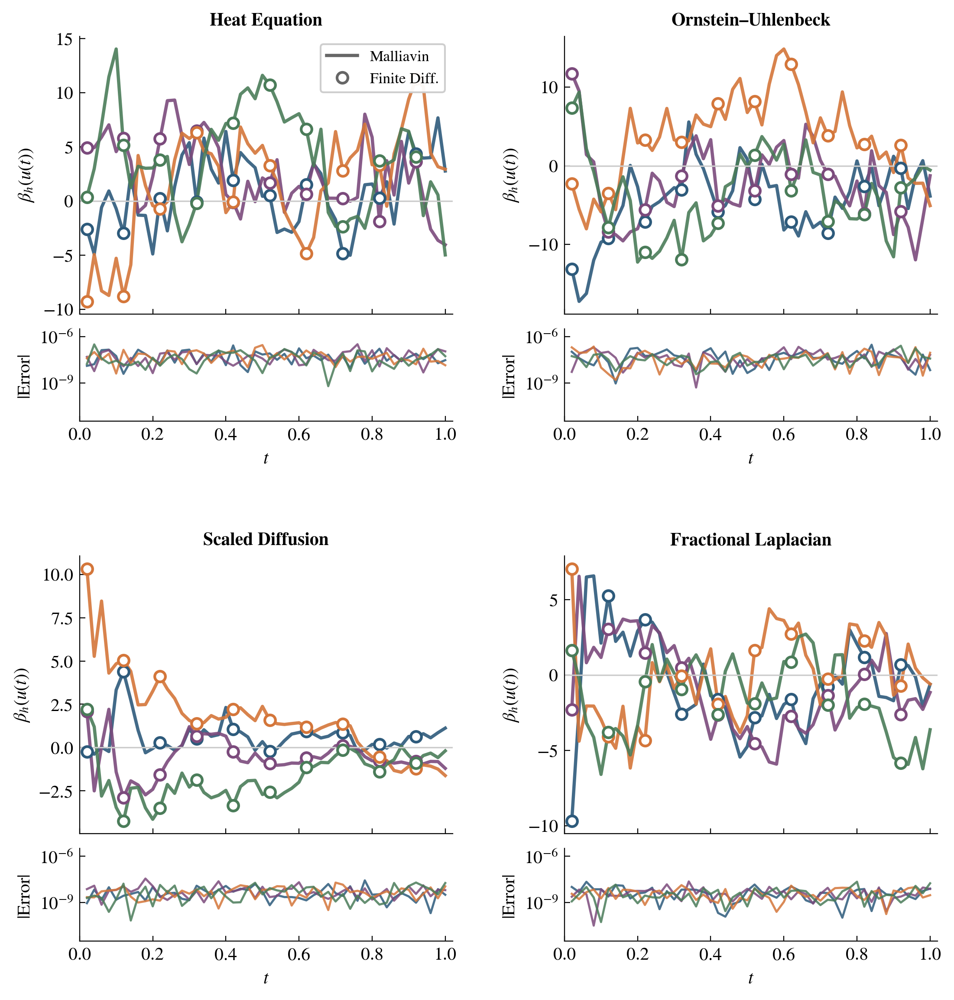
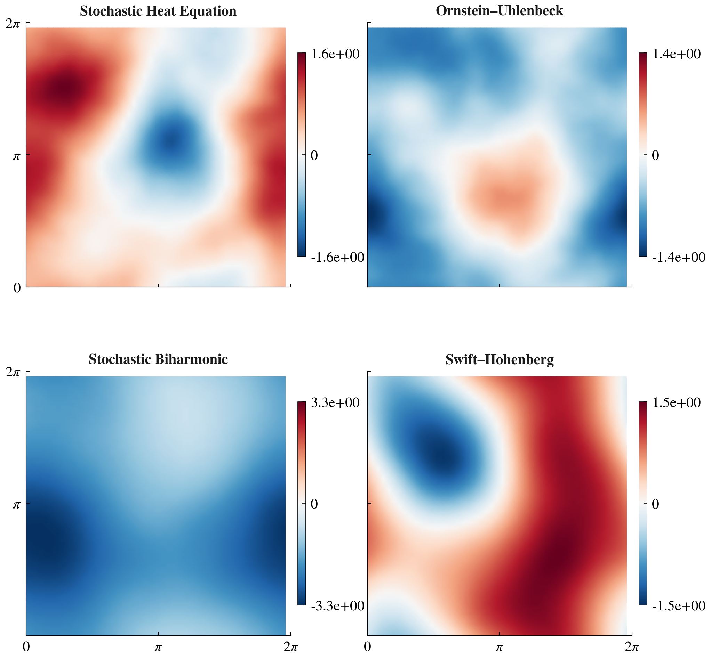
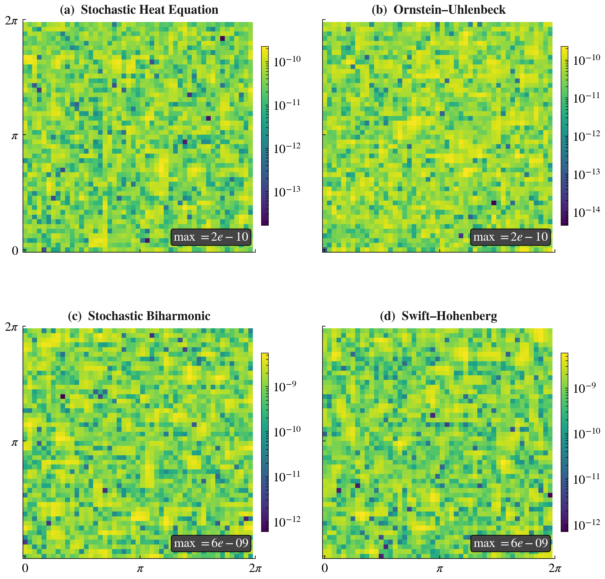
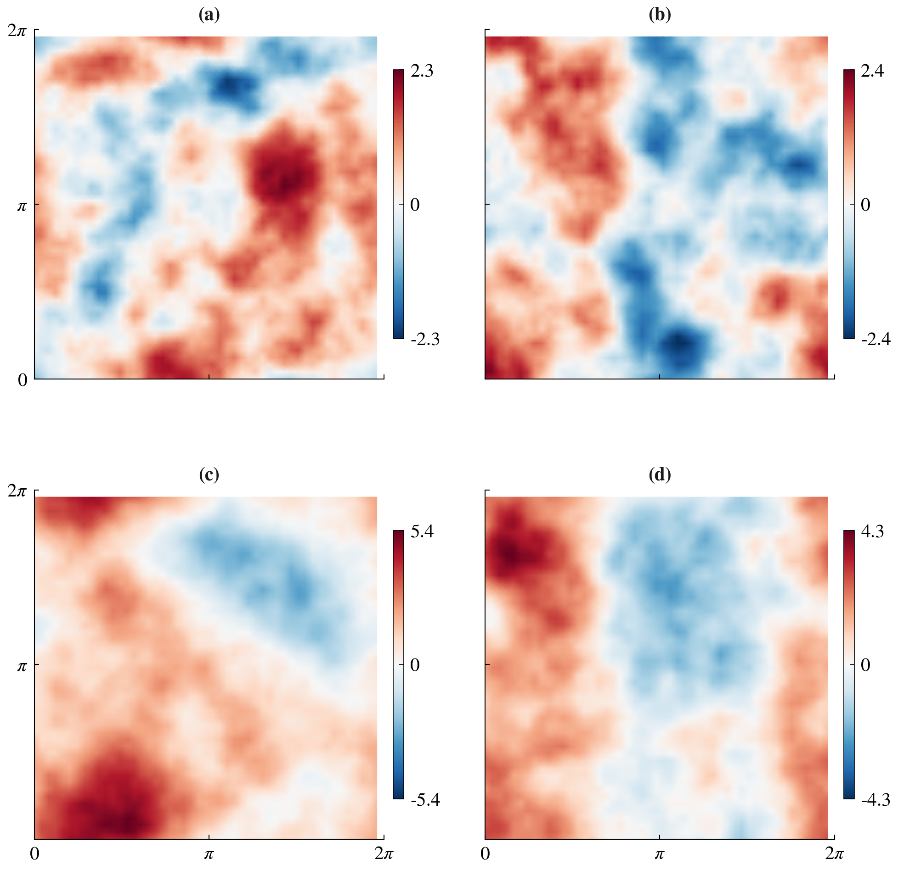

# Score Formula Validation for Infinite-Dimensional SPDEs

[](https://www.python.org/downloads/)
[](https://opensource.org/licenses/MIT)

Numerical validation of the Malliavin score formula for linear stochastic partial differential equations (SPDEs), accompanying the paper:

> **Score-Based Diffusion Models in Infinite Dimensions: A Malliavin Calculus Perspective**
>
> E. Mirafzali, F. Proske, D. Venturi, R. Marinescu

## Overview

This repository validates the closed-form logarithmic derivative (score function) for infinite-dimensional diffusion processes governed by linear SPDEs of the form

$$\mathrm{d}u(t) = Au(t)\,\mathrm{d}t + Q^{1/2}\mathrm{d}W_t, \quad u(0) = u_0 \in H,$$

where $H$ is a separable Hilbert space, $A$ generates a strongly continuous semigroup $S(t) = e^{tA}$, and $Q^{1/2}: U \to H$ is a Hilbert–Schmidt operator introducing spatially correlated (coloured) noise.

The **Malliavin score formula** (Theorem 4 of the paper) states that for directions $h \in \mathcal{H}_t := \mathrm{Ran}(\gamma_t^{1/2})$ (the Cameron–Martin space), the logarithmic derivative of the transition measure is

$$\beta_h(u) = -\langle u - S(t)u_0, \gamma_t^{-1} h \rangle_H,$$

where $\gamma_t = \int_0^t S(s) Q^{1/2}(Q^{1/2})^* S(s)^* \,\mathrm{d}s$ is the Malliavin covariance operator.

The validation is carried out in two complementary settings:

- **One dimension** (`spde1d.py`): Spectral Galerkin discretisation in the Laplacian sine eigenbasis on $(0,1)$ with Dirichlet boundary conditions.
- **Two dimensions** (`spde2d.py`): Fourier spectral method on $[0,2\pi]^2$ with periodic boundary conditions.

## Repository Structure

```
├── spde1d.py          # 1D score validation (spectral Galerkin)
├── spde2d.py          # 2D score validation (Fourier spectral)
├── requirements.txt
├── LICENSE
├── README.md
└── figures/           # Generated output
    ├── score_validation.{png,pdf,eps}
    ├── score_2d_solution.{png,pdf,eps}
    ├── score_2d_error.{png,pdf,eps}
    └── score_2d_noise.{png,pdf,eps}
```

## SPDE Classes

### One Dimension (`spde1d.py`)

Four classes of linear SPDEs on $(0,1)$ with Dirichlet boundary conditions, discretised via $N = 64$ sine modes with noise covariance $q_k = k^{-2}$.

| SPDE | Operator $A$ | Eigenvalues $a_k$ | Parameters |
|------|--------------|-------------------|------------|
| Heat Equation | $\Delta$ | $-(k\pi)^2$ | — |
| Ornstein–Uhlenbeck | $\Delta - \kappa I$ | $-(k\pi)^2 - \kappa$ | $\kappa = 2$ |
| Scaled Diffusion | $\nu\Delta$ | $-\nu(k\pi)^2$ | $\nu = 0.1$ |
| Fractional Laplacian | $-(-\Delta)^\alpha$ | $-(k\pi)^{2\alpha}$ | $\alpha = 0.75$ |

### Two Dimensions (`spde2d.py`)

Four classes of linear SPDEs on $[0,2\pi]^2$ with periodic boundary conditions, discretised via $49 \times 49$ Fourier modes with noise covariance $q_{k_1,k_2} = (1 + k_1^2 + k_2^2)^{-2}$.

| SPDE | Operator $A$ | Eigenvalues $a_{k_1,k_2}$ | Parameters |
|------|--------------|---------------------------|------------|
| Stochastic Heat Equation | $\nu\Delta$ | $-\nu(k_1^2 + k_2^2)$ | $\nu = 1$ |
| Ornstein–Uhlenbeck | $\nu\Delta - \kappa I$ | $-\nu(k_1^2 + k_2^2) - \kappa$ | $\nu = 1$, $\kappa = 2$ |
| Stochastic Biharmonic | $-\mu\Delta^2$ | $-\mu(k_1^2 + k_2^2)^2$ | $\mu = 1$ |
| Swift–Hohenberg | $(r{-}1)I - 2\Delta - \Delta^2$ | $r - (1 - k_1^2 - k_2^2)^2$ | $r = -0.5$ |

## Mathematical Framework

### Malliavin Covariance in Eigenspace

Each eigenmode $u_k(t)$ is Gaussian with mean $m_k(t) = e^{a_k t} u_{0,k}$ and variance

$$\gamma_k(t) = q_k \cdot \frac{e^{2a_k t} - 1}{2a_k},$$

with the convention $\gamma_k(t) = q_k t$ when $a_k = 0$. The Malliavin score formula in eigenspace reduces to

$$\beta_h(u) = -\sum_{k=1}^N \frac{(u_k - m_k) h_k}{\gamma_k}.$$

### Finite-Difference Validation

In 1D, this is validated against the central finite-difference approximation

$$\beta_h^{\mathrm{FD}}(u) = \frac{\log p_t(u + \varepsilon h) - \log p_t(u - \varepsilon h)}{2\varepsilon}, \quad \varepsilon = 10^{-5}.$$

In 2D, the finite difference is applied per Fourier mode to the real and imaginary parts of the centred coefficients; an algebraic identity renders the result exact for Gaussian log-densities.

### Spectral Convergence

Both codes include spectral convergence tests confirming that the truncation fully resolves the solution:

- **1D**: $\mathrm{Tr}(\gamma_t)$ identical at $N = 64$ and $N = 128$ to six significant figures.
- **2D**: $\mathrm{Tr}(\gamma_t)$ identical at $49 \times 49$ and $99 \times 99$ modes to six significant figures, with less than $0.0001\%$ of the solution variance beyond $|k| > 24$.

## Installation

### Requirements

- Python ≥ 3.8
- NumPy
- Matplotlib

```bash
pip install -r requirements.txt
```

## Usage

### One-Dimensional Validation

```bash
python spde1d.py
```

Generates `figures/score_validation.{png,pdf,eps}` and runs the 1D spectral convergence test.

### Two-Dimensional Validation

```bash
python spde2d.py
```

Generates three figures in `figures/`:

- `score_2d_solution.{png,pdf,eps}` — Stochastic component fields for each SPDE
- `score_2d_error.{png,pdf,eps}` — Pointwise score error on logarithmic scale
- `score_2d_noise.{png,pdf,eps}` — Four independent realisations of the coloured noise

Also runs the 2D spectral convergence test.

### Typical Output

**1D** — All four SPDEs achieve errors in the range $10^{-11}$ to $10^{-7}$, consistent with the $\mathcal{O}(\varepsilon^2)$ truncation error of the central finite-difference scheme.



**2D** — Pointwise errors at machine precision: $\mathcal{O}(10^{-10})$ for second-order operators, $\mathcal{O}(10^{-9})$ for fourth-order operators (where larger eigenvalues amplify floating-point rounding).







## Citation

```bibtex
@article{mirafzali2025score,
  title={Score-Based Diffusion Models in Infinite Dimensions: 
         A Malliavin Calculus Perspective},
  author={Mirafzali, Ehsan and Proske, Frank and Venturi, Daniele 
          and Marinescu, Razvan},
  journal={arXiv preprint},
  year={2025}
}
```

## License

MIT License. See [LICENSE](LICENSE) for details.

## Acknowledgements

This work was supported by the U.S. Department of Energy under grant DE-SC0024563.
